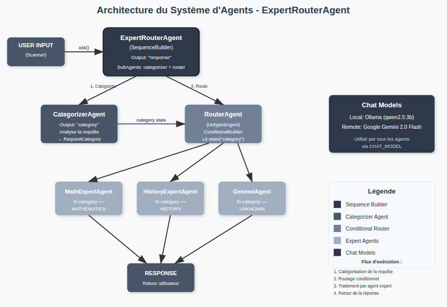

# langchain4j-playground-agentic

## Prerequisites

### Local setup (default)
Start Ollama and pull the required model:
```bash
ollama serve
ollama pull qwen2.5:3b
```

### Remote setup
Set the Google API key environment variable:
```bash
export GOOGLE_API_KEY=your_api_key_here
```

## Running
```
mvn exec:java \
    -Dexec.mainClass="org.srozange.langchain4j.EntryPoint" \
    -Dexec.classpathScope="runtime"
```

## Architecture
